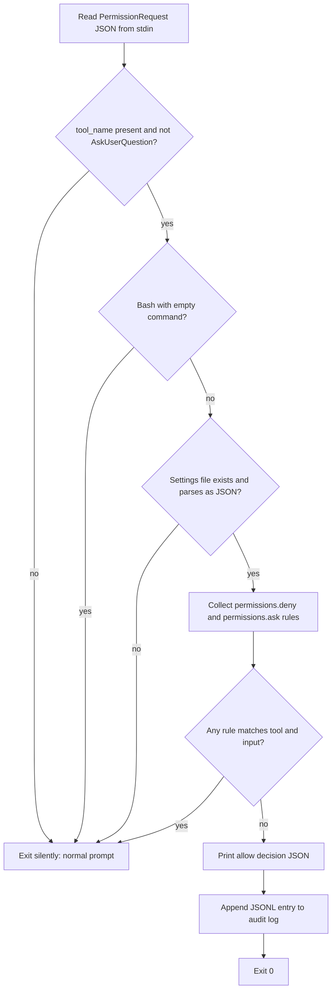

# PermissionRequest Hook Decision Flow

`auto-approve-safe.sh` is a single bash script that Claude Code runs for each `PermissionRequest` event. It either prints an `allow` decision (suppressing the prompt) or prints nothing and exits 0 (letting the normal prompt appear). It has no other outputs besides the audit log described in [Audit log](../domain/audit-log.md).

## When to consult this page

Read this page before changing anything about which tools are auto-approved, how input is extracted per tool, what happens on bad input, or what the hook prints. Rule-matching details (globs, regexes) live in [Rule matching](../domain/rule-matching.md); this page owns the surrounding control flow.

## Input contract

The hook reads one JSON object from stdin. It uses three fields:

- `tool_name` (required; empty means fall back to prompt).
- `tool_input.command` for `Bash`.
- `tool_input.file_path` for `Read`, `Write`, and `Edit`.
- `reason` (optional, copied into the audit log).

Every other tool gets an empty `TOOL_INPUT`, so only bare-tool rules can match it (see [Rule matching](../domain/rule-matching.md)).

## Decision pipeline

Evaluation order in `auto-approve-safe.sh`:

1. Read stdin and parse `tool_name` and `reason` with `jq`. An empty `tool_name` exits silently.
2. Exit silently for `AskUserQuestion`. This tool is routed through `PermissionRequest` in recent Claude Code versions, and auto-approving it would swallow the user's answer (see [Design history](design-history.md)).
3. Extract the relevant input. For `Bash`, trim leading and trailing whitespace with `sed`. An empty Bash command exits silently.
4. If `CLAUDE_SETTINGS` (default `$HOME/.claude/settings.json`) does not exist, exit silently.
5. Run `jq empty` on the settings file. If it is not valid JSON, exit silently. This guard prevents a parse failure from emptying the rule sets and approving everything.
6. Read `.permissions.deny[]` and `.permissions.ask[]` and concatenate them into one block-rule list.
7. Loop over block rules. The first rule that matches sets `BLOCKED=true` and breaks. Matching semantics are documented in [Rule matching](../domain/rule-matching.md).
8. If blocked, exit silently. Otherwise print the allow JSON, append the audit entry, and exit 0.



Caption: the hook's branching control flow. Every "Prompt" branch prints nothing, so Claude Code falls back to the normal permission prompt.

## Fail-safe behavior

- `set -euo pipefail` plus `trap 'exit 0' ERR` means any unhandled error exits 0 with no output, which is the prompt fallback.
- `jq` parse failures on the input are swallowed with `|| true`, and the subsequent empty `tool_name` exits silently.
- Settings problems (missing file, malformed JSON) fall back to prompting rather than approving with empty rules.
- Malformed individual rules (not matching `ToolName(pattern)` or bare `ToolName`) are skipped with `continue`; valid rules still apply.
- The audit-log write uses `>> "$LOG_FILE" 2>/dev/null || true`, so a logging failure never changes the decision. The allow JSON is printed before the log write.

Because `set -u` is active, `HOME` must be set. If it is not, the default settings path cannot be expanded, the script aborts, and it prompts. See [Test suite](../testing/test-suite.md) for how this surfaces in tests.

## Output contract

The only approval output is a single line:

```json
{"hookSpecificOutput":{"hookEventName":"PermissionRequest","decision":{"behavior":"allow"}}}
```

No other output form exists. A deny or ask is expressed by printing nothing. The hook never emits a `deny` decision, so user-configured rules are never enforced by the hook itself; they only withhold approval.

## Invariants for future changes

- A non-approval path must never print output. Tests treat empty output as "prompt".
- Allow decisions depend only on deny and ask rules. `allow` rules in settings.json are ignored by the script.
- The check for `AskUserQuestion` runs before tool-specific extraction and before rule loading.
- The settings validation (`jq empty`) must stay before rule extraction; removing it reintroduces the malformed-settings bypass fixed in commit `c2017ff`.

## Extension points

- New tool input extraction: add a branch to the `TOOL_NAME` if-chain that sets `TOOL_INPUT`. Any tool whose input is not extracted is matched by bare-tool rules only, and pattern rules for it block conservatively.
- Settings sources: `CLAUDE_SETTINGS` and `CLAUDE_PERMISSIONS_LOG` already override the default paths; they exist for tests and are described in [Installation and configuration](../operations/installation-and-configuration.md).

## Focused validation

- Run `./test-auto-approve.sh` for the full harness (it is fast and covers all of the paths above). Tests named "should approve" and "should prompt" in the section headers map to allow and silent-exit outcomes.
- For a single case, pipe JSON into the script with `CLAUDE_SETTINGS` and `CLAUDE_PERMISSIONS_LOG` pointing at temp files, then check for empty output.

## Related pages

- [Architecture overview](overview.md) places this hook in the Claude Code permission flow.
- [Rule matching](../domain/rule-matching.md) owns the `BLOCKED` loop semantics.
- [Audit log](../domain/audit-log.md) owns the entry written after an allow.
- [Test suite](../testing/test-suite.md) maps behaviors to test sections.
tions.
low.
- [Test suite](../testing/test-suite.md) maps behaviors to test sections.
