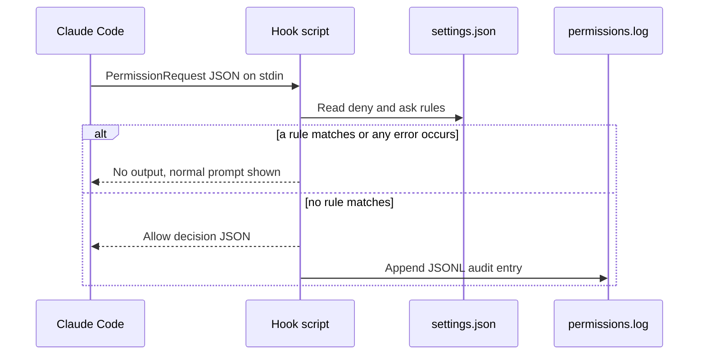

# Architecture Overview

`claude-auto-approve` is a single-purpose tool: a Claude Code `PermissionRequest` hook. It auto-approves permission prompts that the user's own rules do not block, so subagents and long workflows are not stuck on false-positive heuristics. The repository is small: one runtime script, one test script, a README, a license, and an OpenWiki workflow.

## When to consult this page

Start here to understand how the pieces connect, then go to the page for the component you are changing. Use [Quickstart](../quickstart.md) to route a specific task.

## Components

| Component | Role | Detailed page |
|---|---|---|
| `auto-approve-safe.sh` | The hook. Reads a request on stdin and prints an allow decision or nothing. | [Hook decision flow](hook-decision-flow.md) |
| Deny and ask rules in `settings.json` | Owned by the user. The sole source of what is blocked. | [Rule matching](../domain/rule-matching.md) |
| `permissions.log` | JSONL audit trail of each approval. | [Audit log](../domain/audit-log.md) |
| `test-auto-approve.sh` | End-to-end harness that runs the hook with mock JSON and checks stdout. | [Test suite](../testing/test-suite.md) |
| README installation steps | The only install mechanism; there is no package. | [Installation and configuration](../operations/installation-and-configuration.md) |
| `.github/workflows/openwiki-update.yml` | Refreshes this wiki through an external reusable workflow. | [Wiki maintenance](../operations/wiki-maintenance.md) |

The history that explains the current guards is in [Design history](design-history.md).

## Runtime relationship

Claude Code invokes the hook for each `PermissionRequest`. The hook reads the rules at that moment, so edits to `settings.json` apply without restarting anything. Only an approval produces a log entry.



Caption: the request/response path between Claude Code, the hook, the rule source, and the audit log.

## Key constraints

- The hook is stateless. Each invocation reads its input and settings afresh; nothing is cached between requests.
- The hook can only withhold approval. It never emits a deny, so enforcement of user rules is always the normal prompt.
- Runtime dependencies are `jq` and bash 4+, both listed in [Installation and configuration](../operations/installation-and-configuration.md).

## Repository layout

```text
auto-approve-safe.sh             hook runtime (single file)
test-auto-approve.sh             test harness (66 cases)
README.md                        user documentation: install, rules, log format
LICENSE                          MIT
.github/workflows/openwiki-update.yml   wiki refresh caller
.github/workflows/security-scan.yml     org security scan caller
openwiki/                        this knowledge base (generated)
```

There is no build, package, or generated-code step. The only validation is the test harness and bash syntax checking.

## Related pages

- [Hook decision flow](hook-decision-flow.md) is the first page to read for runtime changes.
- [Design history](design-history.md) explains why the guards are ordered the way they are.
for runtime changes.
- [Design history](design-history.md) explains why the guards are ordered the way they are.
