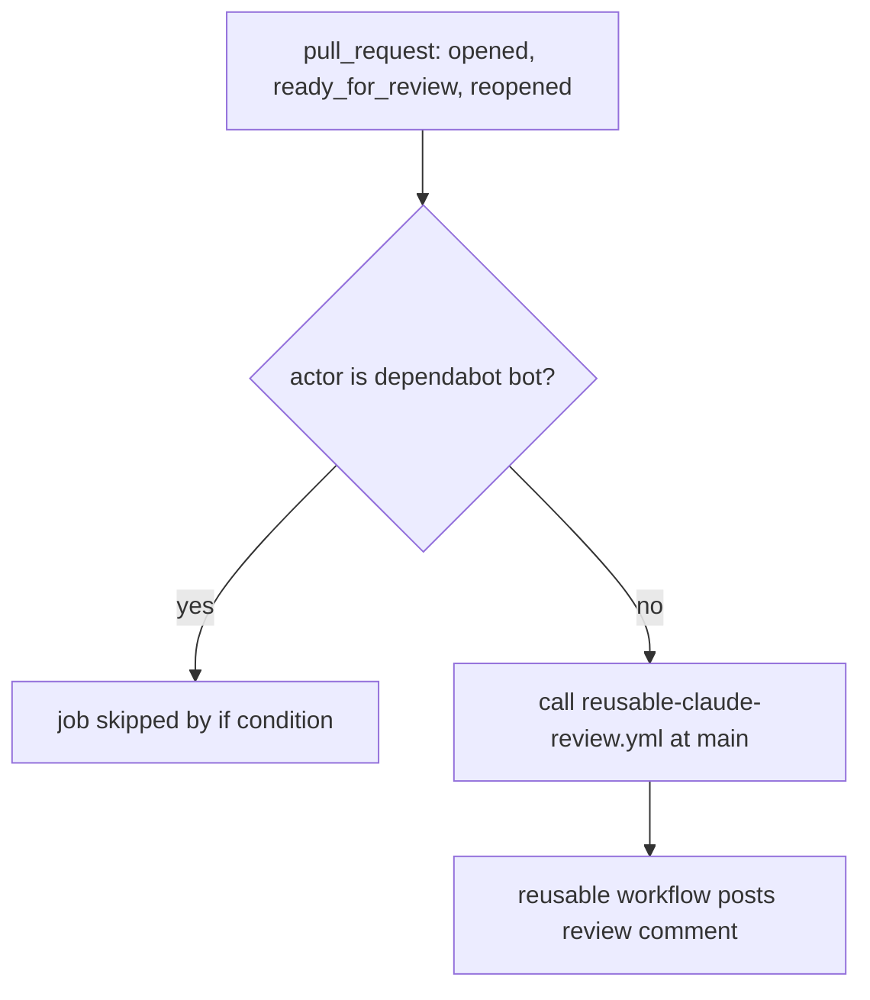

# Claude Review Workflow

`.github/workflows/claude-review.yml` requests an automated Claude review of pull requests. Like the [security scan](security-scan-workflow.md) and the [OpenWiki caller](wiki-maintenance.md), it is a thin caller: the review logic lives in `PSD401/.github/.github/workflows/reusable-claude-review.yml@main`, an organization-owned workflow that is not vendored in this repository. This repository's file decides when the review runs, which permissions and secrets the reusable workflow receives, and nothing else.

The commit that added it (`1ef84f6`, "Add the org Claude review") describes the intent: one severity-tiered review comment per pull request, advisory only, with no approval or merge blocking. Those behaviors come from the commit message and the reusable workflow, not from this file.

## When to consult this page

Consult this page when the review does not start on a pull request, when it fails with a permission or `startup_failure` error, or when changing its triggers. Review content, model choice, and comment format are in the reusable workflow, which this repository cannot inspect. Do not add review logic to this file; change the reusable workflow instead.

## Trigger and guard model

Caption: the caller-side gating. Everything after the `uses:` line happens in the reusable workflow.

- The only trigger is `pull_request` with types `opened`, `ready_for_review`, and `reopened`. `synchronize` is not listed, so a new push to an open pull request does not start a review. Adding it would change the behavior from one review per pull request opening to one per push; treat that as a deliberate decision.
- The job-level `if: github.actor != 'dependabot[bot]'` skips Dependabot pull requests. The file comment says a Dependabot-triggered caller cannot grant `id-token: write` to the reusable workflow, which fails with `startup_failure`. The comment also says the reusable workflow self-guards, so both checks are needed.
- There is no `paths` filter, no `concurrency` group, and no `workflow_dispatch`. The commit message says OpenWiki-only pull requests are skipped, but nothing in this file implements that skip, so it is evidence-blocked here.

## Permissions and secrets

The job sets `contents: read`, `pull-requests: read`, `issues: read`, and `id-token: write`. The inline comment says the calling repository must grant these because the organization default token is read-only and a reusable workflow cannot elevate it. `id-token: write` is the only write-type scope in this file, and it is the reason the Dependabot guard exists.

The job passes one secret by name: `BEDROCK_API_KEY: ${{ secrets.BEDROCK_API_KEY }}`. It does not use `secrets: inherit`. Commit `4563a70` made this change so the review job no longer receives every organization and repository secret; the commit message says the reusable workflow reads only `BEDROCK_API_KEY`, the organization-level key for Claude on the district's Amazon Bedrock account. This repository holds no credential. When adding a secret that the reusable workflow needs, add it by name here; do not restore `secrets: inherit`.

## Deliberate choices

- The reusable workflow is pinned to `@main`, not to a tag or SHA. The file comment says this is deliberate so central changes from the organization's standards propagate to every repository. The same convention appears in [Wiki maintenance](wiki-maintenance.md) and [Security scan workflow](security-scan-workflow.md).
- Inline `zizmor: ignore[unpinned-uses]` comments suppress the scanner's finding for the unpinned reference. Removing the `@main` pin requires removing these comments too.

## Invariants for future changes

- Keep the `id-token: write` grant on this caller. The reusable workflow cannot elevate its token, so removing the grant breaks the review.
- Keep the `dependabot[bot]` guard together with the `id-token` grant. Removing the guard reintroduces the `startup_failure` the comment describes.
- Keep the `@main` reference and its suppression comments together.
- Changing the trigger types changes when reviews appear; verify the change against the intended pull request lifecycle, not only against the YAML syntax.

## Focused validation

There are no tests for this workflow and no local build. The narrowest check is a YAML review of `.github/workflows/claude-review.yml`. Behavior can only be confirmed on the hosting platform: open, mark ready, or reopen a pull request in a non-Dependabot branch and check the Actions run. The workflow has no `workflow_dispatch` trigger, so a manual run is not available.

## Evidence limits

The reusable workflow's steps, model choice, prompt, comment format, and whether the review is a required status are not in this repository. The advisory and merge-neutral behavior described above comes from the commit message, not from code here. These details are tracked as an evidence-blocked item in the [quickstart backlog](../quickstart.md#backlog).

## Related pages

- [Security scan workflow](security-scan-workflow.md) is the sibling caller with read-only permissions and a different trigger set.
- [Wiki maintenance](wiki-maintenance.md) describes the OpenWiki caller and the shared `@main` pinning convention.
- [Architecture overview](../architecture/overview.md) lists this workflow among the repository's components.
- [Design history](../architecture/design-history.md) records when the review was added.
